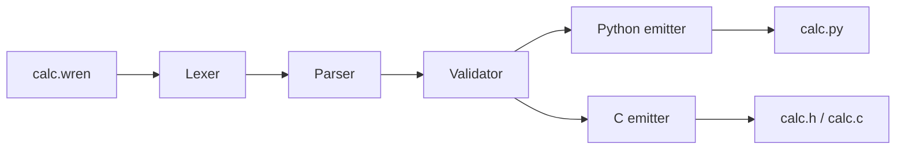
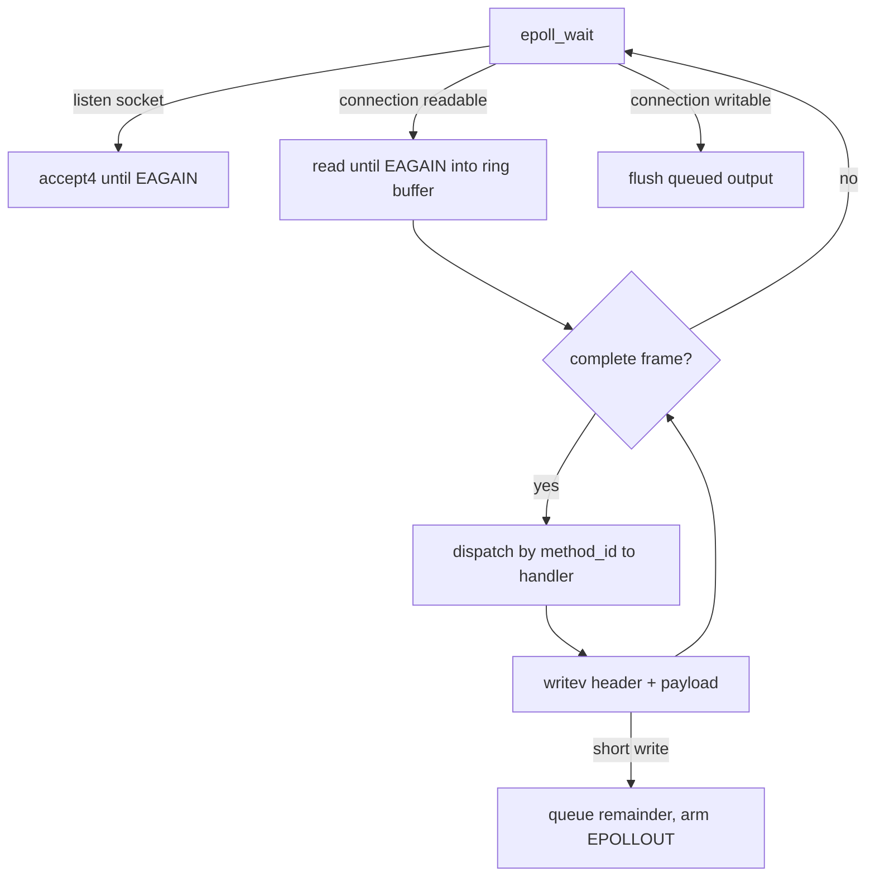

# wren

wren is a very minimal RPC framework built from scratch. Not really useful at all yet, but fun. It has:

- a wire protocol I spec'd out first ([PROTOCOL.md](PROTOCOL.md))
- a C server using edge-triggered epoll
- a Python client
- **wrengen**, a schema compiler that generates typed C servers and Python clients, so you get to write `calc.add(3, 4)` instead of packing bytes by hand

On my machine it does **over 200,000 requests/s at 0.34 ms p99 with 50 clients**, on a single thread (closed-loop, no pipelining, loopback, WSL2 on a Core Ultra 9 275HX; details in [Benchmarks](#benchmarks)).

Here's the example client talking to the example server:

```
$ python examples/calc/client.py 9000
add(3, 4) = 7
multiply(6, 7) = 42
distance_between((0, 0), (3, 4)) = 5.0
sum_array([1, 2, 3, 100]) = 106
divmod(17, 5) = (3, 2)
divmod(1, 0) failed: code 1: division by zero
list_admins() = [Row(id=1, name='alice', role='admin'), Row(id=4, name='diana', role='admin')]
log_message sent (see the server's output)
```

## How it works

You write a schema:

```wren
struct Point { f64 x; f64 y; }

service Calc {
    add(u32 a, u32 b) -> u32;
    distance_between(Point p1, Point p2) -> f64;
    divmod(u32 a, u32 b) -> (u32 quotient, u32 remainder);
}
```

On the C side you just write the handlers. The generated code does all the decoding and encoding:

```c
static int calc_add(wren_call_t *call, uint32_t a, uint32_t b, uint32_t *result) {
    *result = a + b;
    return 0;
}

static Calc_handlers handlers = { .add = calc_add, /* ... */ };
Calc_register(server, &handlers, &state);
wren_server_run(server);
```

On the Python side you get a normal class:

```python
from wren import Client
from calc import Calc, Point          # generated

with Calc(Client("localhost", 9000)) as calc:
    calc.add(3, 4)                                          # 7
    calc.distance_between(Point(0, 0), Point(3, 4))         # 5.0
    q, r = calc.divmod(17, 5)                               # (3, 2)
```

### wrengen



It's a pretty standard compiler pipeline. The parser follows the grammar in [SCHEMA.md](SCHEMA.md) and builds an AST that keeps line numbers. The validator then catches things that parse fine but don't make sense. unknown types, duplicate names, reserved names, and more than one service. It reports all of them at once as `file:line:col: error: ...`, so by the time the emitters run, they can assume the schema is valid.

### The protocol

Every message is a 12-byte header plus a payload (full spec in [PROTOCOL.md](PROTOCOL.md)):

| Offset | Size | Field     |                                               |
| -----: | ---: | --------- | --------------------------------------------- |
|      0 |    4 | length    | total length, including the header            |
|      4 |    1 | type      | 1 CALL, 2 RESPONSE, 3 ERROR                   |
|      5 |    1 | flags     | reserved, always 0                            |
|      6 |    2 | method_id | which method a CALL is calling                |
|      8 |    4 | req_id    | echoed back so you can match replies to calls |

Payloads are built from 13 primitive types (ints, floats, bool, bytes, strings), which combine into structs and arrays. Everything is big-endian.

### The server loop



## Some decisions I made

**I wrote the spec first.** PROTOCOL.md and SCHEMA.md came before the code, and I treat them as the source of truth. Any rule the validator enforces is written in the spec first, along with why.

**One thread with edge-triggered epoll instead of a thread per connection.** There are no locks and no context switching between clients. Edge-triggered means you only get notified once when a socket becomes readable, so the loop has to read until `EAGAIN`. The downside is that one slow handler holds up everyone else (see [Limitations](#limitations)).

**A ring buffer per connection.** It only shifts unread bytes to the front when it runs out of room at the end, and it grows by doubling up to 64 MiB. Anything claiming to be bigger than that closes the connection, which is what the spec says to do.

**`writev` for replies.** The header and payload go out in one syscall instead of two. I also turned on `TCP_NODELAY` so small replies don't get held back by Nagle's algorithm.

**Validation is its own pass.** Syntax errors pile up on each other, so the parser just stops at the first one. Semantic errors don't, so the validator reports all of them. The emitters never have to deal with a bad schema.

**Making bad schemas impossible to write.** Structs have to be declared before they're used, which means it is impossible to write a recursive struct, so there's nothing to detect. Names starting with `_` or `wren_` are reserved for generated code, so names can never clash in either language.

**Generated code plus a small runtime.** The generated code stays short and readable, and the actual encoding logic lives in one place that's tested once (`wren.codec` in Python, `wren/codec.h` in C).

**Decoded data lives exactly as long as the call.** In C, decoded strings point straight into the received message, and decoded arrays come from a per-call arena that gets freed after the handler returns. Array lengths are checked against how many bytes actually arrived before anything is allocated, so a bad length can't make the server try to allocate gigabytes.

## Running it

You need Linux (for epoll), gcc and Python 3.9+.

```bash
git clone https://github.com/ktaffy/wren.git && cd wren
python3 -m venv .venv && source .venv/bin/activate
pip install -e python -e wrengen

make -C examples/calc                  # runs wrengen and builds the server
./examples/calc/build/calc_server 9000 &
python examples/calc/client.py 9000
```

To generate code for your own schema:

```bash
wrengen myservice.wren --lang py --out gen/    # gen/myservice.py
wrengen myservice.wren --lang c  --out gen/    # gen/myservice.h, gen/myservice.c
```

## Tests

```bash
make test
```

That runs everything, and GitHub Actions runs it on every push:

- **C unit tests** for the codec and arena
- **wrengen tests** for the lexer, parser, validator and CLI. The generated Python is checked against a golden file. The generated C gets compiled with `-Wall -Wextra -Werror`, and its bytes are compared against the generated Python's byte for byte.
- **Python client tests**, including 19 interop tests against the C server. every primitive type, arrays, strings, errors, buffer limits, and concurrent clients is tested
- **End to end:** the calc example built with wrengen, with every method called over TCP from the generated Python client

## Benchmarks

I wrote a C load generator for this (`bench/loadgen.c`). Each connection sends one call, waits for the reply, then sends the next (no pipelining). Every reply gets checked, and latency is the full round trip. Each number is the median of 3 runs, 10 seconds each after a 2-second warm-up. The full setup and raw results are in [bench/RESULTS.md](bench/RESULTS.md).

**My Setup:** Intel Core Ultra 9 275HX, 24 cores, server pinned to core 0, WSL2 (kernel 6.6.87.2-microsoft-standard-WSL2), gcc 13.3.0 with `-O2`, TCP loopback.

| Method |   Payload | Conns | Throughput (req/s) | p50 (µs) | p99 (µs) |
| ------ | --------: | ----: | -----------------: | -------: | -------: |
| noop   |         - |     1 |             34,811 |     24.8 |     57.4 |
| noop   |         - |    10 |            217,962 |     44.7 |     65.4 |
| noop   |         - |    50 |            213,200 |    228.2 |    324.5 |
| noop   |         - |   100 |            209,001 |    462.2 |    650.7 |
| add    |         - |     1 |             37,150 |     24.7 |     56.7 |
| add    |         - |    10 |            209,577 |     46.2 |     73.7 |
| add    |         - |    50 |            205,678 |    232.4 |    340.4 |
| add    |         - |   100 |            204,841 |    470.1 |    662.4 |
| echo   |      64 B |    10 |            209,178 |     46.2 |     74.8 |
| echo   |    4096 B |    10 |            194,123 |     50.2 |     78.3 |
| echo   |   65536 B |    10 |             79,213 |    119.8 |    207.3 |
| echo   | 1048576 B |    10 |              4,964 |   1972.1 |   2610.7 |

Once there are 10 or more connections, the server's single core maxes out at around 205k–218k req/s, and latency just grows with the number of clients waiting in line. As a sanity check, throughput lines up with connections divided by median latency, which is what you'd expect if there's really only one call in flight per connection. At 64 KB and up, memory bandwidth becomes the limit instead, at about 5.2 GB/s each way.

To run it yourself: `bench/run.sh` (takes about 10 minutes).

## What's where

```
PROTOCOL.md       wire format spec (v0.2)
SCHEMA.md         schema language spec (v0.1)
c/                server runtime: event loop, connections, codec, arena
python/           Python client library (wren)
wrengen/          schema compiler: lexer, parser, validator, emitters, CLI
examples/calc/    generated C server + Python client for calc.wren
bench/            load generator and benchmark script
scripts/test.sh   runs all the tests (make test)
```

## Limitations

- **Handlers run on the event loop thread,** so a slow handler blocks every other client until it's done. Fixing this would need a worker pool or async handlers.
- **The Python client only has one call in flight at a time.** It doesn't multiplex requests by `req_id` yet, and there's no C client.
- **No streaming, compression or auth** yet. They're sketched out as future protocol extensions in PROTOCOL.md.
- **One service per schema, and no imports,** so shared types have to be copied between schemas.
- **The benchmarks are from one machine,** under WSL2, over loopback. Real Linux or a real network will give different numbers.

## What's next

A C client, multiplexing requests in both clients, a worker pool for slow handlers, and the streaming extension from PROTOCOL.md.
